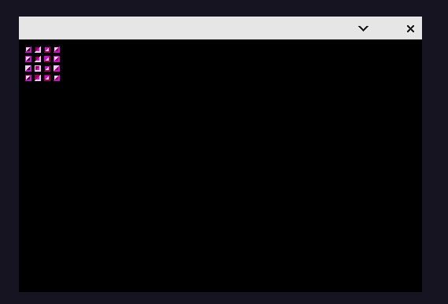
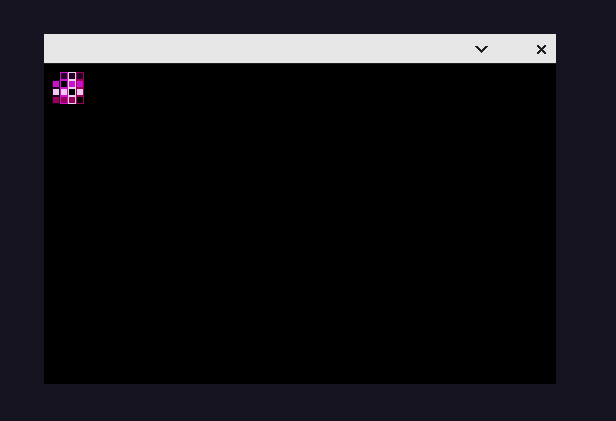

# Eresma - An UXN / Varvara computer



** Eresma is at alpha stage **

Eresma is a fantasy computer using the UXN instruction set and it's compatible with the devices of a Varvara computer.

## How to use it?

Compile your Uxntal programs using a UNX assembler. unxasm.c is included here if you want to use it:

```
gcc -o unxasm unxasm.c
./unxasm <INPUT_FILE> <ROM_FILE>
```

Load your ROM files:

```
cargo run -- <ROM_FILE>
```

Some ROMs are already included. For example:

```
cargo run -- roms/hello-sprites.rom
```

yields:




## Learn more about UXN

* [Uxntal homepage](https://wiki.xxiivv.com/site/uxntal.html)
* [Uxntal reference](https://wiki.xxiivv.com/site/uxntal_reference.html)
* [Varvara reference](https://wiki.xxiivv.com/site/varvara.html)
* [Compudanzas tutorial](https://compudanzas.net/uxn_tutorial.html)